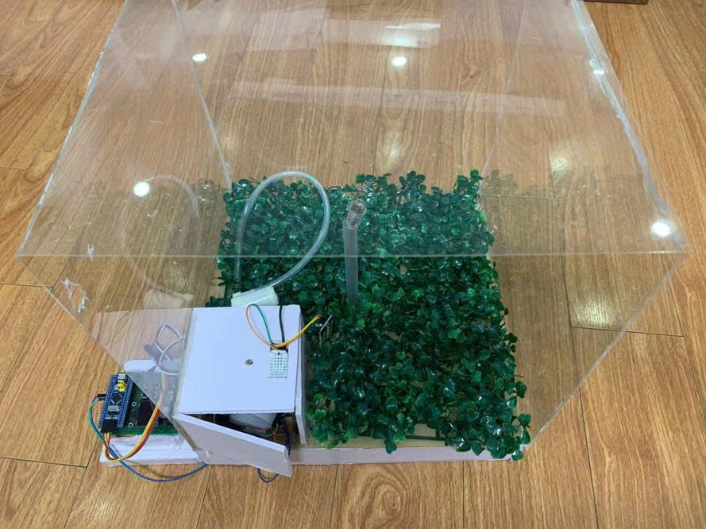
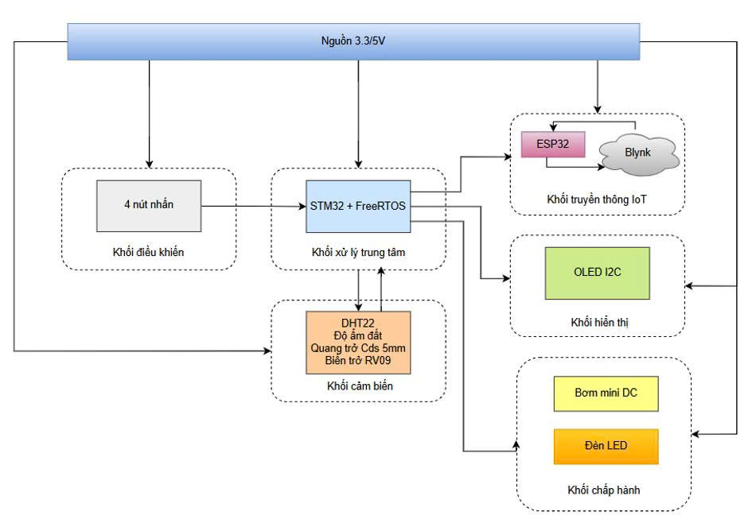
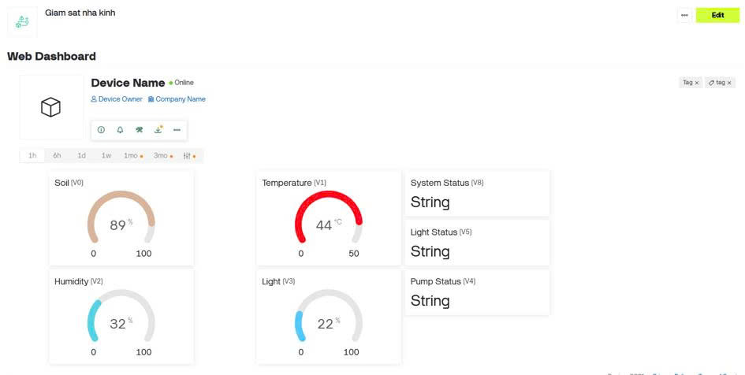

<p align="center">
  
</p>

<p align="center">
  
  
  
  
  
</p>

# IoT Smart Garden Monitoring System (FreeRTOS & IoT Integration)

An IoT-enabled smart garden monitoring and automation system integrating **Embedded Systems**, **FreeRTOS Multitasking**, and **Blynk IoT Cloud** to provide real-time environmental monitoring, automatic irrigation, and remote management for smart agriculture applications.


<p align="center">
  
  <br>
  <em>Figure 1: Completed hardware prototype of the IoT Smart Garden Monitoring System</em>
</p>

## Demo 

https://github.com/user-attachments/assets/0c02adfe-12e3-4f91-88ee-1c123889a296

## Description

Traditional plant care often depends on manual watering and periodic inspection of environmental conditions such as temperature, humidity, soil moisture, and light intensity. This approach is inefficient, time-consuming, and may lead to improper irrigation or unsuitable growing conditions.

**IoT Smart Garden Monitoring System** modernizes this workflow by combining real-time embedded control with cloud-based monitoring.

- **The Monitoring Process:** Environmental sensors continuously measure temperature, humidity, soil moisture, and ambient light intensity.
- **The System's Reaction:** The STM32 processes sensor data using multiple **FreeRTOS tasks**, automatically controls irrigation and lighting according to predefined thresholds, and updates the local OLED display.
- **The IoT Connectivity:** The ESP32 receives processed data through UART, uploads information to the **Blynk IoT Cloud**, and allows users to monitor the system remotely using a smartphone.

In addition, the system supports selecting different plant profiles, each with customized environmental thresholds and watering schedules. Plant information and operating history are stored in Flash memory, allowing the system to recover configuration after power loss.

This project demonstrates how **Embedded Systems, Real-Time Operating Systems (FreeRTOS), and IoT technologies** can be integrated into a practical smart agriculture solution.


## Key Features

- **Real-Time Environmental Monitoring**
  - Temperature
  - Air humidity
  - Soil moisture
  - Ambient light intensity

- **Plant Profile Management**
  - Multiple predefined plant types
  - Individual thresholds for:
    - Temperature
    - Air humidity
    - Soil moisture
    - Light intensity
    - Daily watering frequency

- **FreeRTOS Multitasking**
  - Independent Sensor Task
  - DHT Task
  - Logic Task
  - Display Task
  - Input Task
  - Responsive real-time scheduling

- **Automatic Irrigation**
  - Automatically activates the water pump when soil moisture is below the configured threshold.

- **Automatic Lighting**
  - Automatically turns on supplemental lighting under insufficient ambient light.

- **Cloud-Based IoT Monitoring**
  - Blynk IoT Cloud
  - Remote smartphone monitoring
  - Real-time sensor synchronization

- **Dual-MCU Architecture**
  - **STM32F103C8T6**
    - Sensor acquisition
    - FreeRTOS scheduler
    - Automatic control
    - OLED interface
  - **ESP32**
    - Wi-Fi connectivity
    - UART communication
    - Blynk synchronization

- **Local User Interface**
  - OLED SSD1306 display
  - Four navigation buttons
  - Multi-page menu system

- **Flash Memory Storage**
  - Stores selected plant profile
  - Stores watering history
  - Stores lighting duration
  - Recovers settings after restart

## System Architecture

The system operates on a dual-controller architecture:

<p align="center">
  
  <br>
  <em>Figure 2: System Block Diagram representing the connection between STM32, ESP32, Sensors, and Actuators</em>
</p>

## Hardware Components

| Component | Function |
|------------|----------|
| STM32F103C8T6 | Main controller |
| ESP32 DevKit | Wi-Fi Gateway |
| DHT22 | Temperature & Humidity Sensor |
| Soil Moisture Sensor | Soil Moisture Detection |
| LDR Sensor | Ambient Light Detection |
| Relay Module | Controls Pump & LED |
| Mini DC Water Pump | Automatic Irrigation |
| LED Lamp | Supplemental Lighting |
| OLED SSD1306 | Local Display |
| Push Buttons | Menu Navigation |
| Flash Memory | Configuration Storage |


## FreeRTOS Task Design

The firmware is organized into multiple independent FreeRTOS tasks:

| Task | Responsibility |
|------|----------------|
| SensorTask | Reads soil moisture and light sensors |
| DHTTask | Reads temperature and humidity from DHT22 |
| LogicTask | Compares thresholds and controls pump/LED |
| DisplayTask | Updates OLED display |
| InputTask | Processes button inputs and menu navigation |

This multitasking architecture improves responsiveness, simplifies software maintenance, and allows future expansion.


## Plant Management

The system supports multiple predefined plant profiles.

Each profile contains:

- Temperature threshold
- Humidity threshold
- Soil moisture threshold
- Light threshold
- Daily watering frequency

Users can switch between plant types using the navigation buttons, allowing the system to automatically adjust monitoring and irrigation behavior.


## OLED User Interface

The OLED interface displays:

- Temperature
- Air humidity
- Soil moisture
- Light intensity
- Pump status
- Lighting status
- Watering countdown
- Selected plant profile
- Historical information


## Blynk IoT Dashboard

<p align="center">
  
  <br>
  <em>Figure 3: Blynk IoT Dashboard for remote monitoring</em>
</p>

Example datastreams:

| Virtual Pin | Description |
|-------------|-------------|
| V0 | Temperature |
| V1 | Humidity |
| V2 | Soil Moisture |
| V3 | Light Intensity |
| V4 | Pump Status |
| V5 | LED Status |

## Development Environment

### STM32

- STM32CubeMX
- STM32CubeIDE
- FreeRTOS
- HAL Driver

### ESP32

- Arduino IDE
- ESP32 Arduino Core
- Blynk Library


## Results

The completed system is capable of:

- Monitoring environmental parameters in real time.
- Managing multiple plant profiles.
- Automatically controlling irrigation and lighting.
- Executing concurrent tasks using FreeRTOS.
- Displaying local information through OLED.
- Synchronizing environmental data with Blynk Cloud.
- Supporting remote monitoring through smartphones.
- Restoring configuration after power loss using Flash memory.

## Future Improvements

- MQTT integration
- Cloud database storage
- Historical data visualization
- Web dashboard
- AI-based irrigation prediction
- Weather API integration
- Automatic fertilizer control
- Solar-powered deployment
- Camera-based plant health monitoring
- Mobile notification service
- OTA firmware update


## Contact & Support

**Trieu Ha Giang** - Embedded Systems Engineering Student

```text
Thank you for visiting this repository.
If you have any questions or feedback about the embedded firmware, system architecture, or hardware integration, feel free to reach out directly.
```

**My contact:**

[](mailto:trieuhagiang1312@gmail.com)
[](https://github.com/TrieuHzang)
[](https://www.linkedin.com/in/haazangg/)
